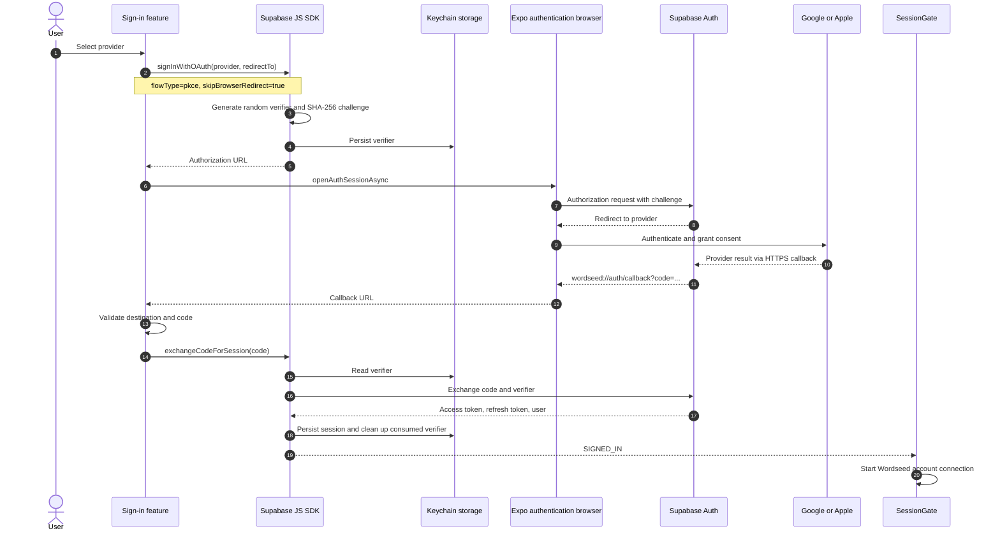
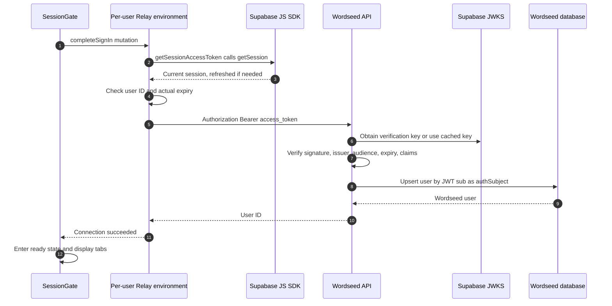
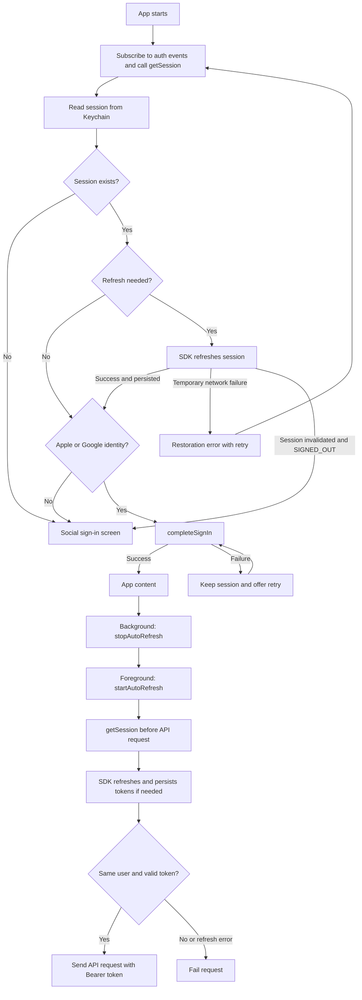

# Mobile Authentication Strategy

This document describes the current implementation. See [Product context](../context/product-context.md) for product policy and the [Mobile README](../../apps/mobile/README.md) for setup.

## Authentication policy

- Apple and Google both use Expo's authentication browser with Supabase OAuth PKCE. Native provider SDK sign-in is not implemented.
- Supabase verifies external identities and manages sessions. Wordseed verifies Supabase JWTs and connects them to application users.
- Email/password sign-in and its development bypass have been removed. Email-only identities are rejected; linked email identities do not disqualify Apple/Google accounts.
- The app imposes no session lifetime or inactivity limit. Short-lived access tokens are renewed with refresh tokens. Logout and server-side session termination still apply.
- Sessions and PKCE verifiers are persisted through react-native-keychain. Authentication is not duplicated in another persistent React store.

## Initial social sign-in

| Direction | Configuration owner | Callback |
|---|---|---|
| Provider → Supabase | Google/Apple console | `https://<project-ref>.supabase.co/auth/v1/callback` |
| Supabase → app | Supabase Redirect URLs and native URL scheme | `wordseed://auth/callback` |

The provider authorization result and the Supabase PKCE code belong to different exchanges. Wordseed API receives neither; it receives the Supabase access token.

### Callback handling

- Active browser callbacks arrive through openAuthSessionAsync.
- Cold-launch callbacks use Linking.getInitialURL(). Sign-in buttons remain hidden until processing completes.
- There is no separate general warm Linking listener. An arbitrary warm callback without an active authentication browser has no independent recovery path.
- Validation requires the wordseed scheme, auth host, and /callback path. Ports, URL credentials, fragments, error responses, and missing/duplicate codes are rejected.
- Concurrent login clicks share one Promise. Code exchanges are deduplicated, retaining the latest eight results in memory.
- The custom iOS 27 SceneDelegate forwards cold-launch URLs and warm URL events. The [config plugin](../../apps/mobile/plugins/with-scene-auth-links.js) applies this handling when that custom SceneDelegate exists.

## Wordseed account connection

- Supabase user.id, represented by JWT sub, maps to Wordseed authSubject. Email is not the account identifier.
- completeSignIn upserts the user and can be repeated after restoration without creating another account.
- The API requires UUID sub/session_id claims, authenticated role, non-anonymous status, and an Apple or Google identity. Its current provider allowlist is apple, google, and email.
- Local session checks select screens; API verification authorizes access.
- Connection failure retains the Supabase session and offers a mutation retry. API downtime does not require another social sign-in.
- Account-merging UI is not implemented. Identities sharing a Supabase user ID share a Wordseed account; Wordseed does not merge different IDs by email.

## Automatic sign-in and refresh

completeSignIn runs for initial connection and restoration, not on every token refresh while ready. SIGNED_OUT independently returns the app to sign-in.

- Client configuration: persistSession=true, flowType=pkce, detectSessionInUrl=false.
- autoRefreshToken initially starts disabled. React Native AppState starts auto-refresh while active and stops it otherwise.
- There is no custom 60-second refresh timer or unconditional foreground refresh. The SDK owns auto-refresh timing and getSession expiry checks.
- Each GraphQL request awaits getSessionAccessToken. Missing sessions, changed user IDs, and actually expired tokens block requests. Server verification still applies.
- INITIAL_SESSION(null) can represent offline restoration failure, so it cannot supersede the explicit startup result. Later SIGNED_IN, SIGNED_OUT, and TOKEN_REFRESHED events take precedence over a late startup snapshot.
- The current configuration also supplies processLock. Installed Supabase 2.116.0 coordinates refreshes internally and emits a deprecation warning for that option. This is unrelated to session lifetime.

### Indefinite session retention

Unlimited retention means no application-enforced maximum duration, not a permanently valid JWT.

| Supabase setting | Intended value |
|---|---|
| Time-box user sessions | Unlimited |
| Inactivity timeout | Unlimited |
| Single session per user | Disabled |
| Access token lifetime | Normal short-lived expiry |

Mobile code does not change server settings. Logout, revocation, or storage loss can require sign-in again. The API verifies JWTs without querying auth.sessions on every request, so immediate rejection of an already-issued JWT after revocation is not guaranteed.

## Logout and cache isolation

1. Logout calls auth.signOut with local scope, not a global logout across devices.
2. After SDK session removal and SIGNED_OUT, the sign-in screen appears. Failed logout calls display an error.
3. AuthenticatedSession unmounts and its Relay environment is no longer used.
4. A different user.id creates a fresh component and Relay store. Refreshing the same user's token retains the store.
5. The old environment's token getter checks identity, preventing previous-user requests from using new-user credentials.

## Responsibilities

| Owner | Responsibility | Source |
|---|---|---|
| Sign-in UI | Provider selection, progress, cancellation, errors | [SignInForm](../../apps/mobile/src/features/sign-in/ui/SignInForm.tsx) |
| Sign-in feature | OAuth initiation, callback validation, PKCE exchange, deduplication | [social-sign-in](../../apps/mobile/src/features/sign-in/api/social-sign-in.ts) |
| Native adapters | Expo browser and Hermes cryptographic APIs | [expo-oauth-browser](../../apps/mobile/src/app/native-auth/expo-oauth-browser.ts), [install-pkce-crypto](../../apps/mobile/src/app/native-auth/install-pkce-crypto.ts) |
| shared/auth | Client construction, secure persistence, request token lookup | [supabase-auth-client](../../apps/mobile/src/shared/auth/supabase-auth-client.ts), [keychain-session-storage](../../apps/mobile/src/shared/auth/keychain-session-storage.ts), [session-access-token](../../apps/mobile/src/shared/auth/session-access-token.ts) |
| app/providers | Configuration, session observation, AppState lifecycle, screen gating | [SessionGate](../../apps/mobile/src/app/providers/SessionGate.tsx), [session-lifecycle](../../apps/mobile/src/app/providers/session-lifecycle.ts) |
| Account connection | Relay mutation definition and execution | [complete-sign-in](../../apps/mobile/src/features/sign-in/api/complete-sign-in.ts) |
| shared/relay | Per-request token lookup and Bearer headers | [relayEnvironment](../../apps/mobile/src/shared/relay/relayEnvironment.ts) |
| API authentication | JWT validation and authenticated principal | [SupabaseAccessTokenVerifier](../../apps/api/src/authentication/infrastructure/supabase-access-token-verifier.ts) |
| API user | Application user lookup/upsert by authSubject | [UserService](../../apps/api/src/user/application/user.service.ts), [PrismaUserRepository](../../apps/api/src/user/infrastructure/prisma-user.repository.ts) |

SessionGate currently also initiates account connection and contains the logout handler. These are actual responsibilities, not a claim that all authentication actions have already been extracted into features.

For Bare React Native, retain Supabase, Keychain, Relay, and the sign-in feature. Keep Expo modules or replace the OAuthBrowser implementation and cryptographic bridge. Configure native URL schemes and callback delivery. The browser is injected through MobileConfiguration.oauthBrowser.

## Storage and troubleshooting

Keychain services use `wordseed.supabase.<SDK storage key>`. On iOS, the adapter selects WHEN_UNLOCKED_THIS_DEVICE_ONLY and does not request iCloud synchronization.

The installed react-native-keychain 10.0.0 iOS bridge tests the presence of the cloudSync NSNumber instead of its boolean value. Passing cloudSync=false is therefore interpreted as enabled. **Omit the option to use its false default.** Recheck native read-after-write and restoration after dependency changes.

| Symptom | Boundary to inspect |
|---|---|
| Unable to start sign-in | Provider configuration, authorization URL, PKCE persistence |
| Unable to open browser | Expo native module and authentication browser |
| Unable to validate response | Callback destination, errors, code format |
| Unable to establish session | exchangeCodeForSession, Keychain verifier, Supabase error code |
| pkce_code_verifier_not_found | Whether the stored verifier can be read back |
| Account connection failure / fetch failed | API process and EXPO_PUBLIC_API_URL reachability |
| Authentication required | JWT issuer, audience, provider, and token validity |

Diagnostics record stages and restricted error names/codes. Do not log tokens, verifiers, authorization codes, complete callback URLs, or provider responses.

## Verification scope

Verified in the development environment on 2026-09-18:

- Native iOS simulator build and Apple/Google buttons.
- Hermes randomness, digest, and TextEncoder APIs, including SHA-256 of a public test string.
- Keychain temporary-value round trip after correcting cloudSync configuration.
- Actual Google sign-in, persisted session restoration after a JavaScript reload, and account connection/Home entry after restoring the API.
- 53 mobile tests and type checking; 17 API authentication/configuration tests and API type checking.

Not yet verified end to end:

- Apple provider configuration and actual Apple sign-in.
- Restoration after process termination, extended-background refresh rotation, session revocation, logout, and account switching.
- Equivalent Android device flows.
- Whether deployed Supabase time-box/inactivity settings are actually unlimited.
- Cold callback recovery after terminating the app during provider authentication. Code exists, but the complete scenario is unverified.

## References

- [Supabase Google OAuth](https://supabase.com/docs/guides/auth/social-login/auth-google)
- [Supabase Apple OAuth](https://supabase.com/docs/guides/auth/social-login/auth-apple): browser OAuth requires client-secret renewal.
- [Supabase sessions](https://supabase.com/docs/guides/auth/sessions)
- [Expo WebBrowser](https://docs.expo.dev/versions/latest/sdk/webbrowser/)
